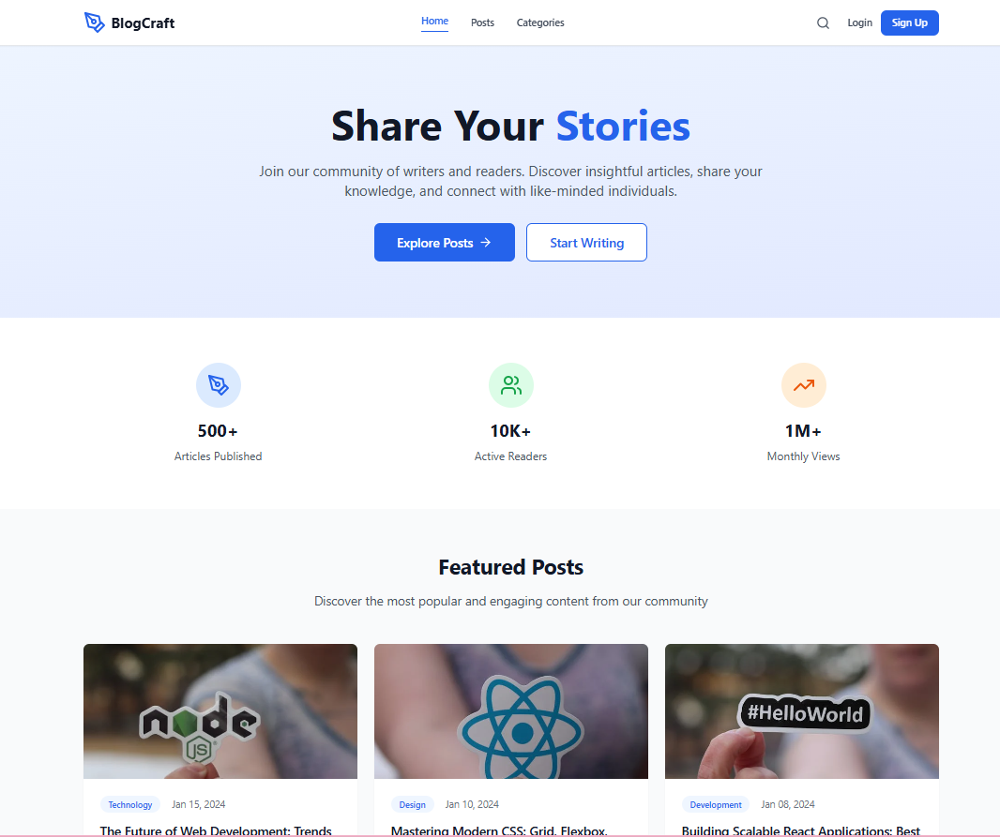
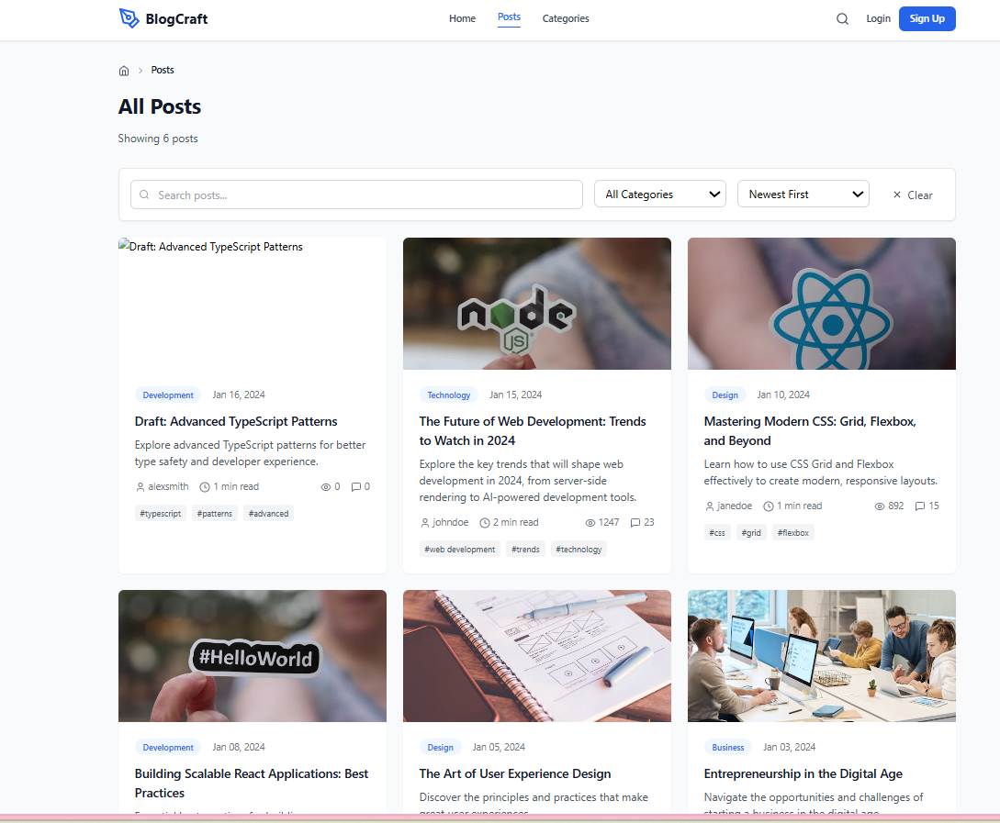
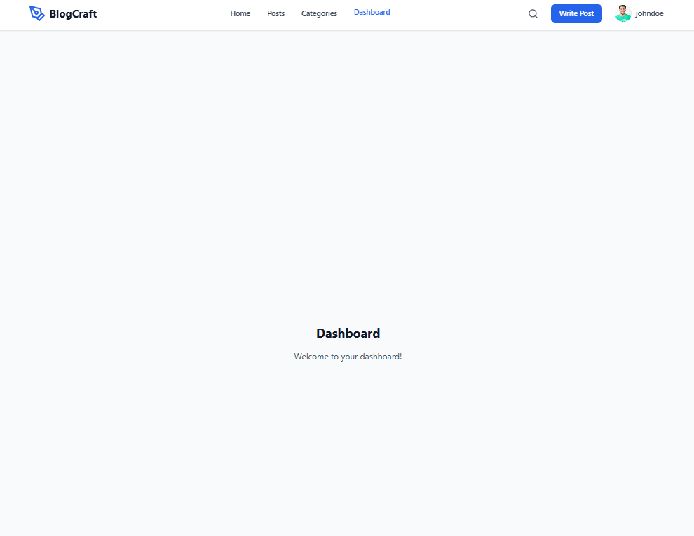

# MERN Blog Application

A modern, full-stack blog platform built with MongoDB, Express.js, React.js, and Node.js. This project demonstrates best practices in web development, security, and user experience, featuring authentication, role-based access, image uploads, and a responsive UI.

---

## 📖 Project Overview

The MERN Blog Application allows users to register, log in, create and manage blog posts, comment, and interact with content. Admins have additional privileges for managing categories and posts. The project is designed for scalability, maintainability, and ease of use.

---

## Project Structure

```
project/
├── client/                  # React frontend
│   ├── public/
│   ├── src/
│   │   ├── components/
│   │   ├── pages/
│   │   ├── hooks/
│   │   ├── services/
│   │   ├── context/
│   │   ├── types/
│   │   └── App.jsx / App.tsx
│   ├── .env
│   └── package.json
├── server/                  # Express backend
│   ├── config/              # Database config
│   ├── controllers/         # Route controllers
│   ├── middleware/          # Custom middleware
│   ├── models/              # Mongoose models
│   ├── routes/              # API routes
│   ├── uploads/             # Uploaded images
│   ├── server.js            # Main server file
│   ├── .env
│   └── package.json
├── screenshots/             # App screenshots for documentation
├── README.md
└── package.json             # (optional, for monorepo scripts)
```

---

## 🚀 Features Implemented

- **User Authentication:** Registration, login, JWT-protected routes
- **Role-based Access:** Admin and user roles
- **Blog Management:** Create, read, update, delete posts
- **Category System:** Organize posts by categories
- **Comment System:** Nested comments and replies
- **Image Upload:** Featured image support for posts
- **Rich Text Content:** HTML content support
- **User Profiles:** Avatars and profile management
- **View Tracking:** Post view count
- **Tag System:** Post tagging
- **Search & Filter:** Advanced search and filtering
- **Pagination:** Efficient data loading
- **Responsive Design:** Mobile-first, accessible UI
- **API Documentation:** Swagger UI at `/api-docs`
- **Security:** Helmet, CORS, password hashing, input validation

---

## 🛠️ Setup Instructions

### Prerequisites

- Node.js (v18+)
- npm or yarn
- MongoDB instance (local or cloud)

### Installation

1. **Clone the repository**
   ```sh
   git clone <repository-url>
   cd project
   ```

2. **Install server dependencies**
   ```sh
   cd server
   npm install
   ```

3. **Install client dependencies**
   ```sh
   cd ../client
   npm install
   ```

4. **Set up environment variables**

   Create a `.env` file in the `server` directory:
   ```env
   PORT=5000
   NODE_ENV=development
   MONGODB_URI=mongodb://localhost:27017/mern-blog
   JWT_SECRET=your-super-secret-jwt-key
   JWT_EXPIRES_IN=7d
   CLIENT_URL=http://localhost:5173
   ```

5. **Seed the database (optional)**
   ```sh
   cd server
   npm run seed
   ```

6. **Start the development servers**

   - **Backend:**  
     ```sh
     cd server
     npm run dev
     ```
   - **Frontend:**  
     ```sh
     cd ../client
     npm run dev
     ```

   The app will be available at:
   - Frontend: http://localhost:5173
   - Backend API: http://localhost:5000
   - API Docs: http://localhost:5000/api-docs

---

## 📚 API Documentation

Interactive API docs are available at [http://localhost:5000/api-docs](http://localhost:5000/api-docs).

### Authentication

- `POST /api/auth/register` — Register a new user
- `POST /api/auth/login` — Login user
- `GET /api/auth/profile` — Get user profile (protected)
- `PUT /api/auth/profile` — Update user profile (protected)

### Posts

- `GET /api/posts` — List posts (with filters, pagination)
- `GET /api/posts/:id` — Get post by ID
- `GET /api/posts/slug/:slug` — Get post by slug
- `POST /api/posts` — Create post (protected)
- `PUT /api/posts/:id` — Update post (protected)
- `DELETE /api/posts/:id` — Delete post (protected)

### Categories

- `GET /api/categories` — List categories
- `GET /api/categories/:id` — Get category by ID
- `POST /api/categories` — Create category (admin only)
- `PUT /api/categories/:id` — Update category (admin only)
- `DELETE /api/categories/:id` — Delete category (admin only)

### Comments

- `GET /api/comments/post/:postId` — List comments for a post
- `POST /api/comments` — Create comment (protected)
- `PUT /api/comments/:id` — Update comment (protected)
- `DELETE /api/comments/:id` — Delete comment (protected)

---

## 🖼️ Screenshots

> Replace the image paths with your own screenshots.

### Home Page


### Post Details


### Admin Dashboard


---

## 🤝 Contributing

1. Fork the repository
2. Create a feature branch: `git checkout -b feature/your-feature`
3. Commit your changes: `git commit -am 'Add new feature'`
4. Push to the branch: `git push origin feature/your-feature`
5. Submit a pull request

---

## 📝 License

This project is licensed under the MIT License.

---

## 🙏 Acknowledgments

- React, Express, MongoDB, Tailwind CSS, and all open-source contributors.
